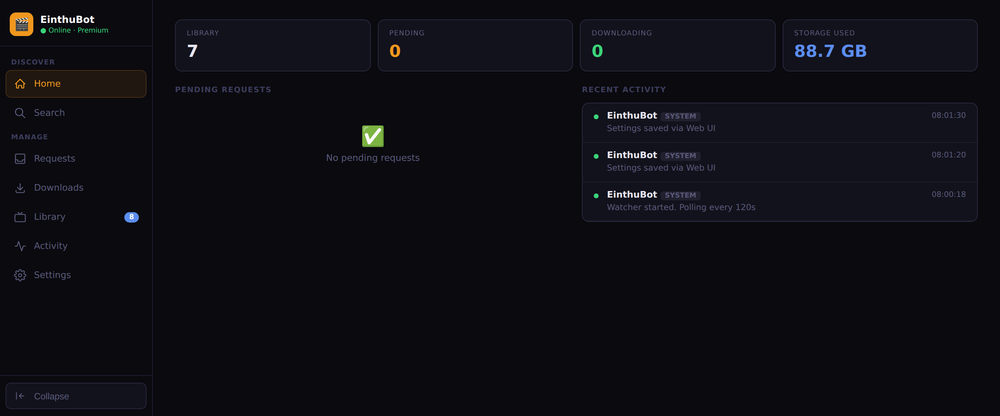
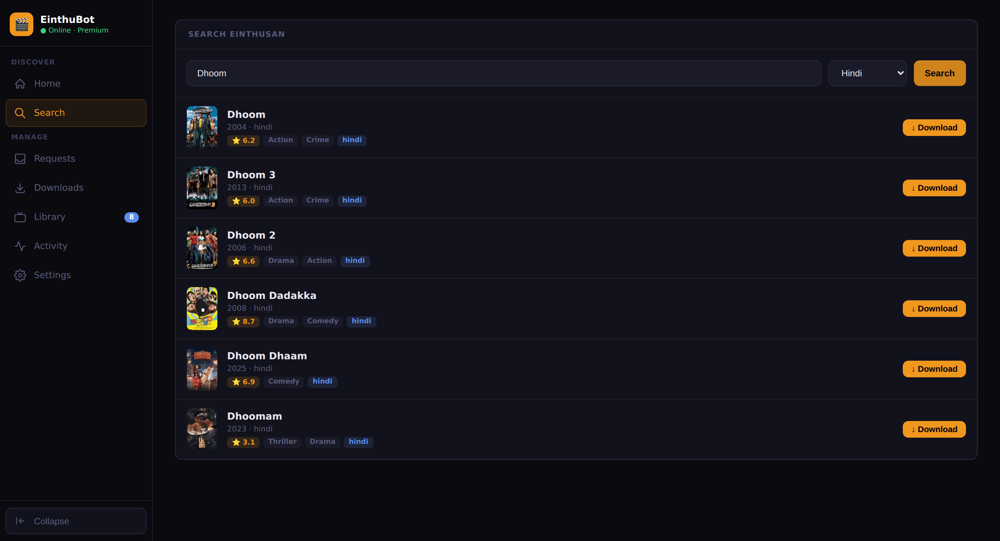
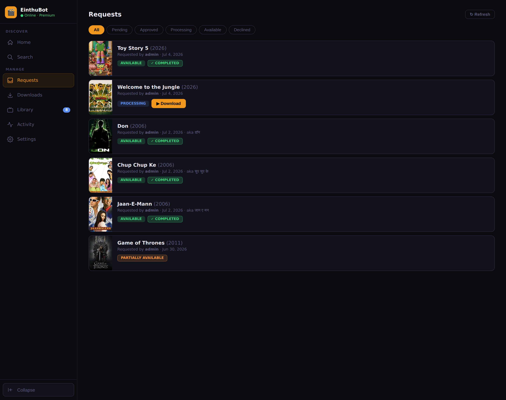
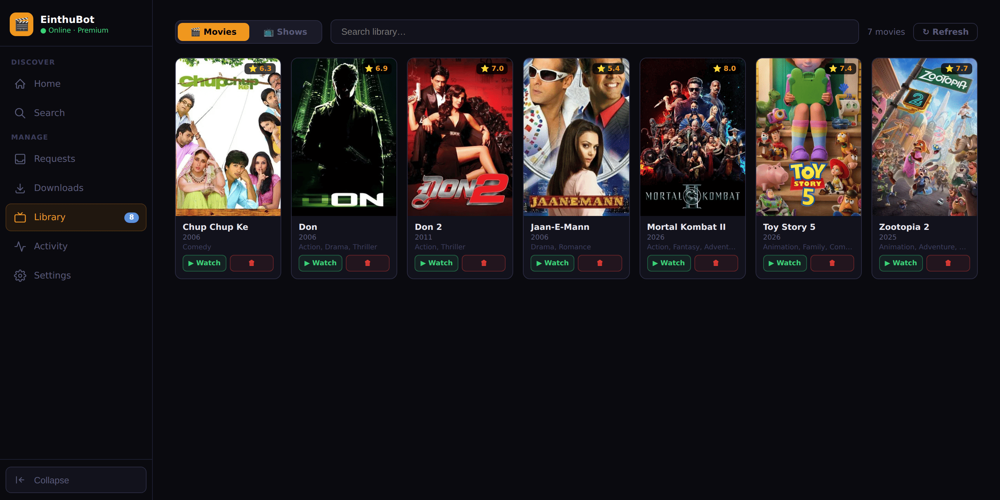
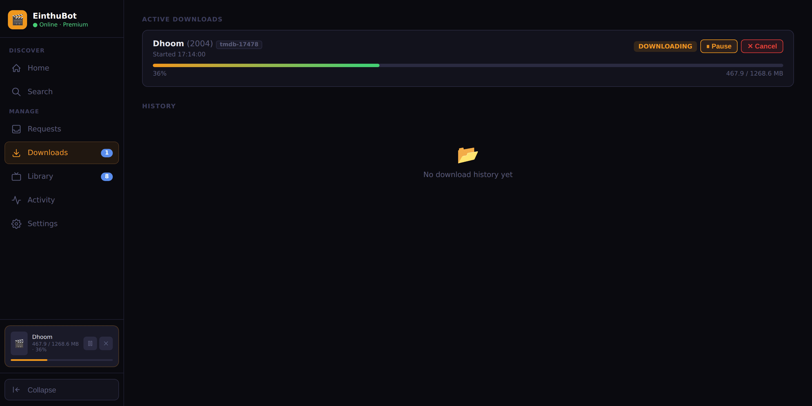
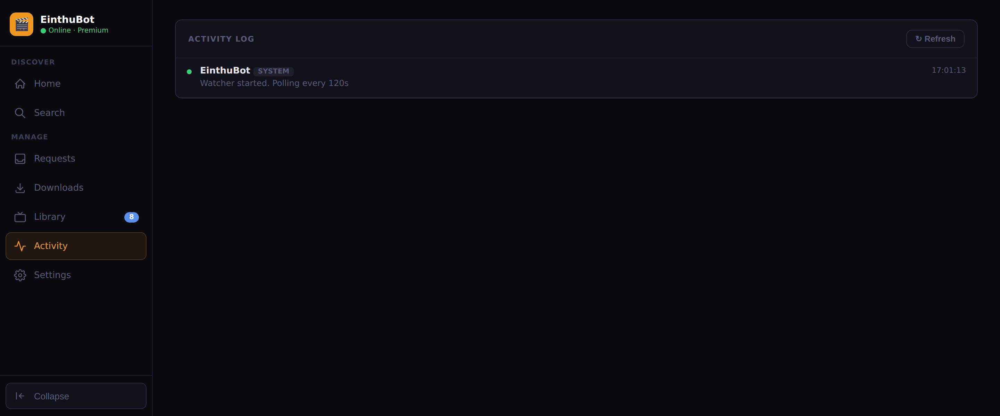
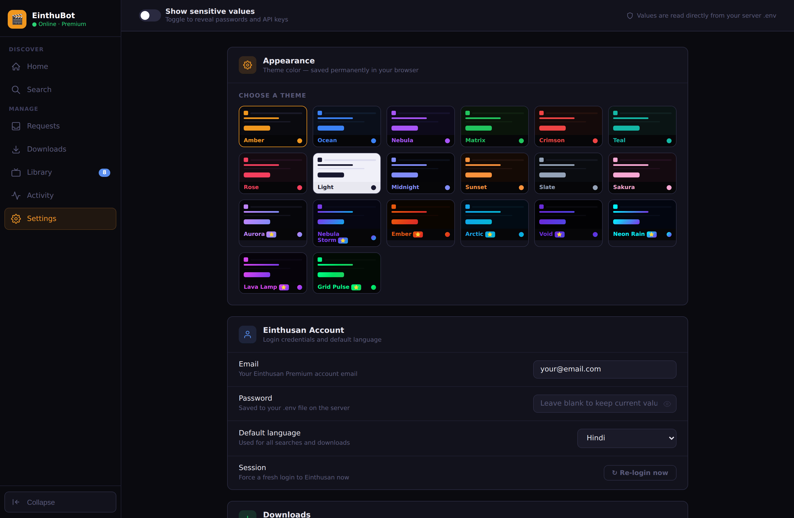

# EinthuBot 🎬

A self-hosted tool that integrates [Einthusan.tv](https://einthusan.tv) Premium into your Jellyfin media stack. Search, request, and download South Asian films directly into your Jellyfin library — with a full web UI, Jellyseerr integration, and TMDB metadata.



---

## Demo

The full flow — search Einthusan, queue a download, and watch it progress live:


---

## Features

- 🏠 **Home dashboard** — at-a-glance stats: library size, active downloads, pending requests and total storage used
- 🔍 **Search** Einthusan across all languages (Hindi, Tamil, Telugu, Malayalam, Kannada, Bengali, Punjabi, Marathi)
- 📥 **Requests tab** — view all Jellyseerr requests and approve them to trigger an automatic Einthusan download
- ⬇️ **Downloads tab** — live progress bar, pause, resume, cancel with automatic file cleanup
- 🎞️ **Library tab** — browse your Jellyfin **movies and TV shows** with TMDB posters, ratings, genres, cast and full detail views. Drill into shows → seasons → episodes, and delete from Jellyfin, disk, and Jellyseerr in one click
- 📋 **Activity log** — full history of every search, match, download and Seerr event
- ⚙️ **Settings tab** — edit all configuration from the browser (writes to `.env`), reveal/hide secrets, and pick from **20 themes** (13 standard + 7 animated exclusives)
- 🔁 **Auto-sync with Jellyfin** — the watcher marks requests available in Jellyseerr once the movie appears in your Jellyfin library
- 🧠 **Smart year-first matching** — prevents wrong movies (e.g. Don 1978 vs Don 2006)
- 🎬 **TMDB integration** — automatic metadata lookup for proper Jellyfin folder naming (`Movie Title (Year) {tmdb-XXXXXXX}`)
- 🖼️ **Image proxy** — serves Jellyfin artwork through the app so browsers can reach container-internal URLs
- 🔒 **File permissions** — downloaded files are automatically set to `777` so Jellyfin can delete them
- 🌐 **CDN failover** — automatically rewrites raw IP CDN URLs to `cdn1.einthusan.io` for reliable downloads
- 🐳 **Docker** — runs as a single container alongside your existing media stack

---

## Requirements

- **Einthusan Premium** account — the download feature requires a premium subscription ($25/year)
- **Docker** and **Docker Compose**
- **Jellyfin** running in Docker
- **Jellyseerr** (optional, for the Requests tab)
- **TMDB API key** (free) — for metadata, posters and proper folder naming
- **Jellyfin API key** — for the Library tab

---

## Installation

### Step 1 — Clone the repo

```bash
git clone https://github.com/aban-waleed/einthubot.git
cd einthubot
```

### Step 2 — Create your `.env` file

```bash
cp .env.example .env
nano .env
```

Fill in all your values:

```env
# ── Einthusan Premium Account ──────────────────────────────────────────────
EINTHUSAN_EMAIL=your@email.com
EINTHUSAN_PASSWORD=yourpassword
EINTHUSAN_LANGUAGE=hindi

# ── Jellyseerr ──────────────────────────────────────────────────────────────
# SEERR_URL should use the container name, not localhost
SEERR_URL=http://seerr:5055
# Get this from: Jellyseerr → Settings → General → API Key
SEERR_API_KEY=your_jellyseerr_api_key

# ── Jellyfin ────────────────────────────────────────────────────────────────
# JELLYFIN_URL should use the container name, not localhost
JELLYFIN_URL=http://jellyfin:8096
# Get this from: Jellyfin → Dashboard → API Keys → + (create new key)
JELLYFIN_API_KEY=your_jellyfin_api_key

# ── TMDB ────────────────────────────────────────────────────────────────────
# Get a free key at: themoviedb.org → Settings → API → Create → Developer
TMDB_API_KEY=your_tmdb_api_key

# ── Download Settings ───────────────────────────────────────────────────────
# Host path to your Jellyfin movies library — mounted into the container.
# docker-compose.yml reads this via ${MEDIA_DIR}, so no need to edit compose.
MEDIA_DIR=/home/your-user/media/movies

# How often to check Jellyseerr for new requests (seconds)
POLL_INTERVAL=120

# Web UI port — use 7879 to avoid conflict with Radarr on 7878
WEB_PORT=7879
```

### Step 3 — Find your Docker network name

EinthuBot needs to join the same Docker network as Jellyfin and Jellyseerr so it can reach them by container name.

```bash
docker network ls
```

Look for the network your Jellyfin stack uses (e.g. `jelly-stack_default`). Then check:

```bash
docker inspect jellyfin | grep -A5 '"Networks"'
```

### Step 4 — Update docker-compose.yml

Open `docker-compose.yml` and replace `jelly-stack_default` with your actual network name in both places it appears:

```yaml
    networks:
      - jelly-stack_default      # ← change this

networks:
  jelly-stack_default:           # ← and this
    external: true
```

The movies volume is driven by `${MEDIA_DIR}` from your `.env`, so you don't need to edit it here:

```yaml
volumes:
  - "${MEDIA_DIR:-/path/to/media/movies}:/downloads/einthusan"
```

### Step 5 — Fix folder permissions

Make sure Jellyfin can read and delete files in your movies folder:

```bash
sudo chmod -R 777 /home/your-user/media/movies
```

### Step 6 — Build and run

```bash
docker compose up -d --build
```

This takes a couple of minutes the first time. When done:

```bash
docker ps | grep einthubot
```

You should see it listed as `Up`.

### Step 7 — Check the logs

```bash
docker logs -f einthubot
```

You should see:

```
[INFO] EinthuBot Web UI → http://0.0.0.0:7878
[INFO] Logged in to Einthusan as your@email.com
[INFO] [system] EinthuBot — Watcher started. Polling every 120s
```

> The app always listens on port **7878 inside** the container. `docker-compose.yml` maps it to host port `${WEB_PORT:-7879}`, so you reach the UI on `7879` by default (avoiding a clash with Radarr on `7878`).

### Step 8 — Open the Web UI

Get your server's IP:

```bash
hostname -I | awk '{print $1}'
```

Then open in your browser:

```
http://YOUR_SERVER_IP:7879
```

You should see a green **Online · Premium** badge in the top right.

---

## Getting API Keys

### Jellyseerr API Key
1. Open Jellyseerr in your browser
2. Go to **Settings → General**
3. Copy the **API Key**

### Jellyfin API Key
1. Open Jellyfin → top right menu → **Administration → Dashboard**
2. Go to **API Keys** in the left sidebar
3. Click **+** to create a new key, name it `einthubot`
4. Copy the key

### TMDB API Key
1. Sign up at [themoviedb.org](https://www.themoviedb.org/signup)
2. Go to **Settings → API → Create → Developer**
3. Fill in the form (app name: EinthuBot, personal use)
4. Copy the **API Key (v3 auth)**

---

## Web UI Tabs

| Tab | Description |
|---|---|
| 🏠 **Home** | Dashboard with live stats — library count, active downloads, pending requests, total storage used |
| 🔍 **Search** | Search Einthusan by title and language, click Download on any result |
| 📥 **Requests** | View all Jellyseerr requests — click ▶ Download to auto-search and download from Einthusan |
| ⬇️ **Downloads** | Live progress bars, pause/resume/cancel, download history |
| 🎞️ **Library** | Browse your Jellyfin **movies and TV shows** with TMDB posters. Open any title for full details — backdrop, cast, genres, overview. Expand shows into seasons and episodes. Delete from Jellyfin + disk + Seerr in one click |
| 📋 **Activity** | Full log of every event |
| ⚙️ **Settings** | Edit all `.env` configuration from the browser, reveal/hide secrets, and choose from 20 themes |

---

## Screenshots

### Search
Search Einthusan by title and language, with TMDB ratings and genres on each result.



### Requests
Every Jellyseerr request with live status — available, processing, partially available — and one-click download.



### Library
Your Jellyfin movies and TV shows with posters, ratings and genres. Watch or delete in one click.



### Downloads
Active downloads with live progress plus a download history.



### Activity
A running log of every search, match, download and Jellyseerr event.



### Settings
Edit all configuration in the browser, toggle to reveal secrets, and pick from 20 themes (13 standard + 7 animated exclusives).



---

## How It Works

```
Jellyseerr request
    → EinthuBot Requests tab (click ▶ Download)
        → Search Einthusan with title + year
        → Year-first smart matching (Don 2006 ≠ Don 1978)
        → Fetch premium MP4 download link from /premium/movie/watch/
        → Stream download to /media/movies/
            → Movie Title (Year) {tmdb-XXXXXXX}/
                → Movie Title (Year) {tmdb-XXXXXXX}.mp4
        → Jellyfin picks up the file on next library scan
```

The background watcher also runs in reverse: every `POLL_INTERVAL` seconds it checks all Jellyseerr requests against your Jellyfin library and marks them **available** in Jellyseerr once the matching movie shows up.

---

## Project Structure

```
einthubot/
├── einthubot.py            # Flask app — watcher loop, API routes, and the
│                           #   Einthusan / Jellyfin / Jellyseerr / TMDB clients
├── requirements.txt        # Python deps: requests, beautifulsoup4, flask, flask-cors
├── Dockerfile              # python:3.12-slim image, listens on 7878
├── docker-compose.yml      # Single service; joins your external Jellyfin network
├── .env.example            # Template for your .env (secrets are gitignored)
├── .gitignore
├── README.md
├── templates/
│   ├── index.html          # App shell — sidebar nav, header, theme engine
│   └── partials/           # Tab bodies loaded via /partials/<name>
│       ├── home.html       # Dashboard + stats
│       ├── search.html     # Einthusan search
│       ├── requests.html   # Jellyseerr requests
│       ├── downloads.html  # Live download progress
│       ├── library.html    # Movies + TV shows
│       ├── activity.html   # Event log
│       └── settings.html   # Config editor + 20 themes
└── logs/                   # Runtime logs (gitignored)
```

### API Endpoints

All served by `einthubot.py`:

| Method | Route | Purpose |
|---|---|---|
| `GET` | `/` | Web UI |
| `GET` | `/partials/<name>` | Render a tab body (home, search, requests, …) |
| `GET` | `/api/status` | Login state + effective config |
| `POST` | `/api/retry_login` | Re-login to Einthusan |
| `GET` | `/api/search?q=&lang=` | Search Einthusan |
| `POST` | `/api/download` | Download a specific Einthusan result |
| `GET` | `/api/downloads` | Active/finished downloads |
| `POST` | `/api/pause/<id>` · `/api/resume/<id>` · `/api/cancel/<id>` · `/api/remove/<id>` | Control a download |
| `GET` | `/api/requests` | Jellyseerr requests (enriched with TMDB) |
| `POST` | `/api/approve` | Approve a request → search + download |
| `GET` | `/api/library` | Jellyfin movies |
| `POST` | `/api/library/delete` | Remove a movie from Jellyfin + disk + Seerr |
| `GET` | `/api/shows` | Jellyfin TV shows |
| `GET` | `/api/shows/<id>/seasons` · `/seasons/<sid>/episodes` | Drill into a show |
| `POST` | `/api/shows/delete` | Remove a show/season/episode |
| `GET` | `/api/storage` | Total library size on disk |
| `GET` | `/api/proxy/image/<id>` | Proxy Jellyfin artwork |
| `GET` | `/api/activity` | Activity log |
| `GET`/`POST` | `/api/settings` | Read / write `.env` config |
| `GET` | `/api/settings/reveal` | Return unmasked secrets (for the reveal toggle) |

---

## Jellyfin Folder Naming

Downloaded files follow Jellyfin's recommended naming convention so metadata matches automatically:

```
/media/movies/
  Don (2006) {tmdb-8195}/
    Don (2006) {tmdb-8195}.mp4
  Boss (2013) {tmdb-228355}/
    Boss (2013) {tmdb-228355}.mp4
  Zootopia 2 (2025) {tmdb-1084242}/
    Zootopia 2 (2025) {tmdb-1084242}.mp4
```

---

## Environment Variables

| Variable | Default | Description |
|---|---|---|
| `EINTHUSAN_EMAIL` | — | Your Einthusan login email |
| `EINTHUSAN_PASSWORD` | — | Your Einthusan password |
| `EINTHUSAN_LANGUAGE` | `hindi` | Default search language |
| `SEERR_URL` | `http://seerr:5055` | Jellyseerr URL (use container name) |
| `SEERR_API_KEY` | — | Jellyseerr API key |
| `JELLYFIN_URL` | `http://jellyfin:8096` | Jellyfin URL (use container name) |
| `JELLYFIN_API_KEY` | — | Jellyfin API key |
| `TMDB_API_KEY` | — | TMDB API key for metadata and posters |
| `MEDIA_DIR` | `/path/to/media/movies` | **Host** path to your Jellyfin movies library (bind-mounted into the container) |
| `DOWNLOAD_DIR` | `/downloads/einthusan` | Container path where MP4s are written (constant; maps to `MEDIA_DIR`) |
| `POLL_INTERVAL` | `120` | Seconds between Jellyseerr polls |
| `WEB_PORT` | `7879` | **Host** port for the Web UI (mapped to `7878` inside the container) |

---

## Updating

```bash
cd ~/einthubot
git pull
docker compose down && docker compose build --no-cache && docker compose up -d
```

---

## Troubleshooting

**Login fails**
Check your Einthusan email and password in `.env`. Hit **Re-login** in the Web UI header.

**Wrong movie downloaded**
EinthuBot uses year-first matching — the year from TMDB is used to filter Einthusan results before title matching. Check the Activity log to see what was searched and matched.

**No download URL found**
Your premium session may have expired. Hit **Re-login** in the Web UI.

**Port already in use**
Change `WEB_PORT` in `.env` — default `7879` avoids conflict with Radarr on `7878`.

**Jellyfin can't delete files**
Run `chmod -R 777 /your/media/movies` on the host machine.

**Container exits immediately**
Run `docker logs einthubot` and check the error. Most common causes are wrong network name in `docker-compose.yml` or missing `.env` values.

**Network not found error**
Run `docker network ls` to find your network name, then update both occurrences in `docker-compose.yml`.

**Movies show as Unknown in Requests tab**
Make sure `TMDB_API_KEY` is set in `.env` and added to the `environment:` section of `docker-compose.yml`.

**Jellyfin Library tab not loading**
Make sure `JELLYFIN_API_KEY` and `JELLYFIN_URL` are set in both `.env` and `docker-compose.yml`. The URL must use the container name (e.g. `http://jellyfin:8096`), not `localhost`.

---

## Stack

- **Python 3.12** + Flask + BeautifulSoup4
- **TMDB API v3** for metadata, posters and cast
- **Jellyfin API** for library management
- **Jellyseerr API** for request management
- **Docker** for deployment

---

## Notes

- Requires an active **Einthusan Premium** subscription — the download feature is a premium-only feature of the platform
- Downloads are streamed directly from Einthusan's CDN (`cdn1.einthusan.io`) to your server
- The Jellyseerr watcher polls for new pending requests every `POLL_INTERVAL` seconds — for immediate downloads use the Search or Requests tab manually
- All downloaded files and folders are created with `777` permissions so Jellyfin can manage them

---

## License

Released under the [MIT License](LICENSE) © 2026 Aban Waleed.
